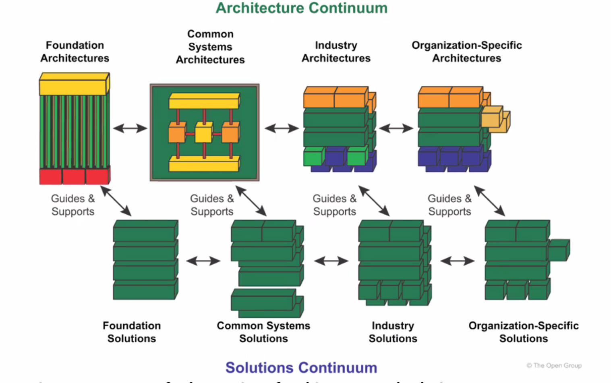
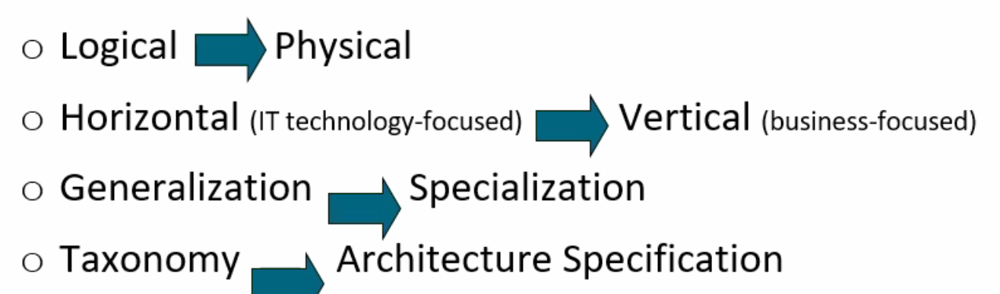

# TOGAF EA 

## Enterprise Continuum

- Reference Model can be part of Foundation Architecture
- Compared to Architecture content framework, yet another tool for your daily architecture work.

Foundation --> Common Systems --> Industry --> Organization-Specific

### Architectures Continuum

### Solution Continuum