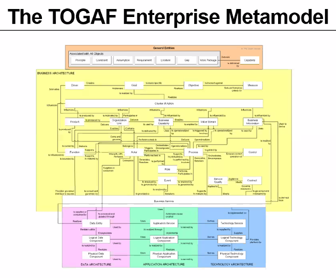

# Architecture
Application Architecture
- A description of the **structure and interaction** of the applications that provide **key business capabilities** and **manage the data assets**.

Architecture Landscape
- The architectural representation of assets in use, **or planned**, by the enterprise at particular **points in time**.

Architecture Model
- A representation of a **subject of interest**.
- An architecture model provides a smaller scale, simplified, and/or abstract representation of the subject matter.

Capability Architecture
- An architecture that describes the abilities that an enterprise possesses.

Data Architecture
- A description of the structure of the enterprise's major types and sources of data, logical data assets, physical data assets, and data management resources.

Technology Architecture
- A description of the **structure and interaction** of the technology services and technology components.

Segment Architecture
- A detailed, formal description of areas within an enterprise, used at **the program or portfolio level** to organize and align change activity.

Strategic Architecture
- A summary formal description of the enterprise, providing an organizing framework for operational and change activity, and an executive-level, long-term view for direction setting.
- Similar to Segment Architecture with different level

Transition Architecture
- A formal description of one state of the architecture at an architecturally significant point in time.
- used to describe the **progression** in time from the Baseline to the Target Architecture.

# Business
Business Architecture
- A representation of holistic, multi-dimensional business views of: **capabilities, end-to-end value delivery, information, and organizational structure**; and the relationships among these business views and strategies, products, policies, processes, initiatives, and stakeholders.

Business Model
- A model describing the rationale for how an enterprise creates, delivers, and captures value.

# Model
Metamodel
- A model that describes the entities used in building an Architecture Description, their characteristics, and the key relationships between those entities.
- Describe the architecture framework in use within the Enterprise
- TOGAF framework is a metamodel example
- The model of model

Modeling
- A technique through construction of models which enables a subject to be represented in a form that enables **reasoning, insight, and clarity** concerning the essence of the subject matter.

# Others
Artifact
- An architectural **work product** that describes an aspect of the architecture.

Capability
- An ability that an organization, person, or system possesses.

Deliverable
- An architectural work product that is **contractually specified** and in turn formally reviewed, agreed, and signed off by the stakeholders.
- Considered as contracted artifact
- can transitioned into an Architecture Repository as a reference model, standard, or snapshot of the Architecture Landscape at a point in time

Gap analysis
- identify the difference between the Baseline and Target Architecture.

Requirement
- A statement of need, which is unambiguous, testable or measurable, and necessary for acceptability.

Role
- The usual or expected behavior of an actor, or the part somebody or something plays in a particular process or event.
- An actor may have a number of roles.
- The part an individual plays in an organization and the contribution they make through the application of their skills, knowledge, experience, and abilities.

Stakeholder
- An individual, team, organization, or class thereof, having an interest in a system.

Work Package
- A set of actions identified to achieve one or more objectives for the business. 
- can be a part of a project, a complete project, or a program.

# Framework
Content Framework
- identifies *Deliverables* that are outputs from executing the ADM cycle and inputs at other ADM phases
