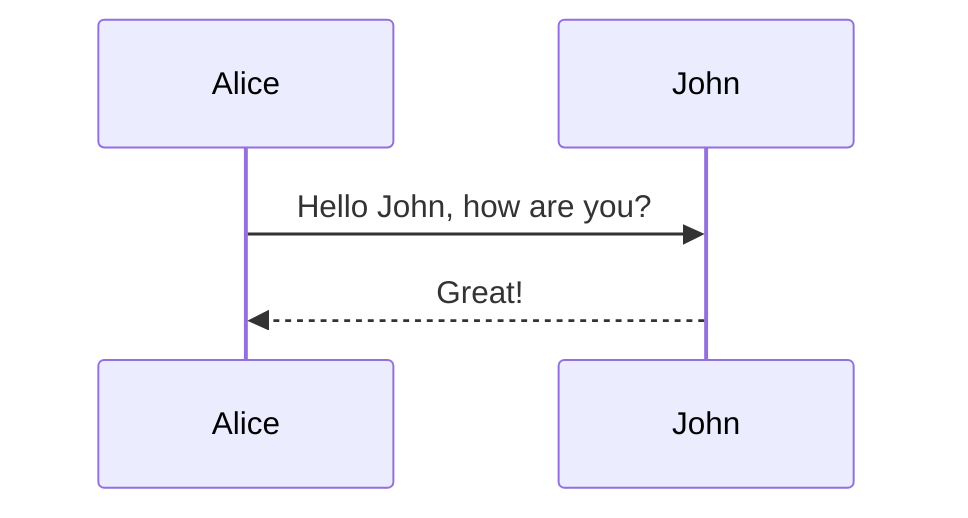

# Mermaid
基于文本的图表渲染工具
- > It is a JavaScript based diagramming and charting tool that renders Markdown-inspired text definitions to create and modify diagrams dynamically.
- [home web](https://mermaid.js.org/)
  - [live editor](https://mermaid.live/)
  - Mermaid.js now lives at mermaid.ai
- award: [The Most Exciting Use of Technology 2019](https://osawards.com/javascript/2019)

主要特点：
- 多种图表：支持流程图、序列图、甘特图、类图、饼图等。
- 开源：免费使用，社区活跃，文档丰富。

- 
# Community
[Community integration list](https://mermaid.ai/open-source/ecosystem/integrations-community.html)

Markdown

- supported in vs code extension, GitHub, GitLab, Logseq
- Sphinx: by extension `sphinxcontrib-mermaid` (pypi)

HTML
```
<pre class="mermaid">
graph TD
    A[开始] --> B{判断}
    B -->|是| C[执行]
    B -->|否| D[结束]
</pre>
<!-- You can also simply wrap by div tag -->
<div class="mermaid">
sequenceDiagram
    Alice->>John: Hello John, how are you?
    John-->>Alice: Great!
</div>

<script src="https://mermaid.js.org/dist/mermaid.min.js"></script>
<script>mermaid.initialize({startOnLoad:true});</script>
```

